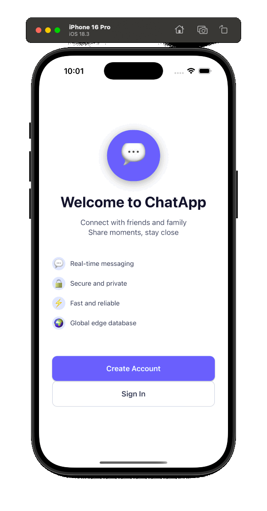

# ChatApp 💬

> **Work in Progress** – A modern real-time chat application built with React Native, Expo, Convex, and Better Auth.

## 🚀 Live Demo

Scan the QR code with Expo Go to try the app:

_QR code will be available once deployed to Expo_

## 📱 Current Features

- ✅ **Real-time Chat Interface** – Send and receive messages with instant updates  
- ✅ **Message Bubbles** – WhatsApp-inspired design with sender distinction  
- ✅ **Responsive Design** – Works beautifully on iOS and Android  
- ✅ **Modern UI** – Clean, professional interface with trustable blue theme  
- ✅ **Timestamps** – Message timing information  
- ✅ **Smooth Animations** – Native-feeling interactions  

## 🛠️ Tech Stack

### Frontend
- **React Native** – Cross-platform mobile development  
- **Expo** – Development platform, builds & deployment  
- **Expo Router** – File-based navigation system  
- **NativeWind** – Tailwind CSS for React Native  
- **TypeScript** – Type safety throughout  

### Backend
- **Convex** – Real-time database and serverless functions  
- **Better Auth** – Authentication and session management  

### Architecture
- **Single Repo** – Simple Expo + Convex project  
- **Shared Types** – Type safety across client & server  
- **Clean Separation** – UI (Expo) / Logic (Convex) / Auth (Better Auth)  

## 🏗️ Project Structure

    chat-app/
    ├── src/              # Expo Router app
    ├── convex/           # Convex backend functions
    ├── assets/           # Images, fonts, and other static assets
    ├── package.json
    └── README.md


## 📋 Roadmap

### Phase 1: Core Chat ✅
- [x] Basic chat interface  
- [x] Message sending/receiving  
- [x] UI/UX foundation  
- [x] NativeWind styling setup  

### Phase 2: Authentication 🚧
- [x] User registration/login with Better Auth  
- [x] User profiles  
- [x] Session persistence  

### Phase 3: Real-time Backend 🔮
- [x] Convex database integration  
- [x] Real-time message synchronization  
- [x] User presence (online/offline)  
- [x] Message persistence  

### Phase 4: Advanced Features 🔮
- [ ] Multiple chat rooms  
- [ ] Group conversations  
- [ ] Media sharing (images, files)  
- [ ] Push notifications  
- [ ] Message reactions  
- [ ] Reply functionality  
- [ ] Message search  

### Phase 5: Polish 🔮
- [ ] Dark/light mode  
- [ ] Chat themes  
- [ ] Animations and transitions  
- [ ] Performance optimizations  
- [ ] Offline support  

## 🚀 Getting Started

### Prerequisites
- Node.js 18+  
- pnpm
- Expo CLI  
- iOS Simulator or Android Emulator (optional)  

### Installation

# Clone the repository
```bash
git clone https://github.com/prudolfs/chat-app.git
cd chat-app
```
# Install dependencies
```bash
pnpm install
```
# Start the Expo app
```bash
pnpm run dev
```


### Development Commands

# Start Expo development server
```bash
pnpm run dev
```

# Start Convex dev server
```bash
npx convex dev
```

## 📱 Testing the App

1. **With Expo Go**: Scan the QR code from your terminal  
2. **iOS Simulator**: Press `i` in the terminal  
3. **Android Emulator**: Press `a` in the terminal  
4. **Web**: Press `w` in the terminal  

## 🎯 Goals & Purpose

This project serves as a:

- **Portfolio Demonstration** – Showcasing full-stack mobile development skills  
- **Modern Architecture Example** – Expo + Convex + Better Auth  
- **Learning Project** – Exploring cutting-edge React Native ecosystem  
- **Open Source Contribution** – Clean, well-documented codebase  

## 🔧 Development Notes

### Current Focus
Core chat functionality with clean, simple UI. Authentication and Convex integration are the next priorities.  

### Architecture Decisions
- **Expo + Convex First** – Keep backend simple, no extra servers  
- **Better Auth Integration** – Modern and secure auth flow  
- **TypeScript Everywhere** – Type safety across frontend and backend  
- **Professional UI** – Trustable blue theme, clean design patterns  

### Known Issues
- Authentication not yet implemented (using mock data)  
- Convex integration in progress  
- Limited to single chat room currently  

## 🤝 Contributing

This is a personal portfolio project, but feedback and suggestions are welcome! Feel free to:

- Open issues for bugs or feature requests  
- Submit PRs for improvements  
- Share feedback on the architecture or design  

## 📄 License

This project is open source and available under the [MIT License](LICENSE).  

## 👨‍💻 Author

**Rudolfs Pukitis**  

- LinkedIn: [Rudolfs Pukitis](https://www.linkedin.com/in/rudolfs-pukitis-33027a154/)  
- GitHub: [@prudolfs](https://github.com/prudolfs)  

---

**Status**: 🚧 **Actively in development** – New features being added regularly  

_Last updated: September 2025_  

## 💡 Why This Project?

Building a chat app demonstrates:

- **Real-time functionality** – WebSocket-like live updates with Convex  
- **Complex state management** – Message ordering, presence, notifications  
- **Mobile-first design** – Touch interactions, responsive layouts  
- **Full-stack development** – Frontend, backend, database, authentication  
- **Modern tooling mastery** – Expo, Convex, Better Auth  
- **Production concerns** – Performance, offline support, scaling  

This showcases the complete skill set needed for modern mobile application development.  
